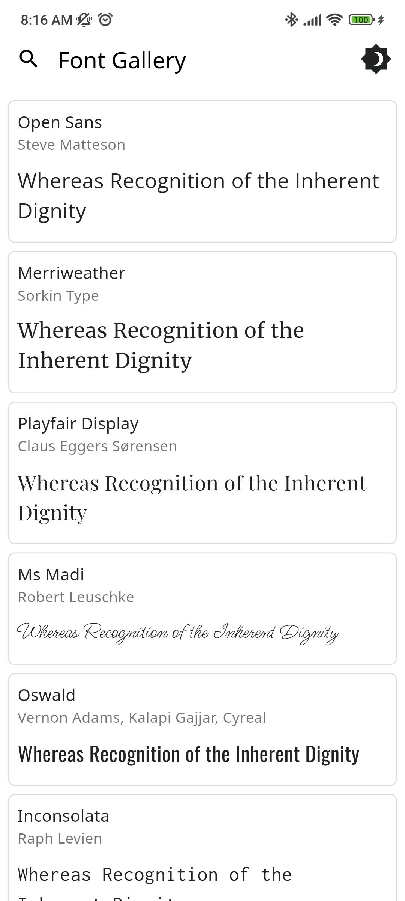
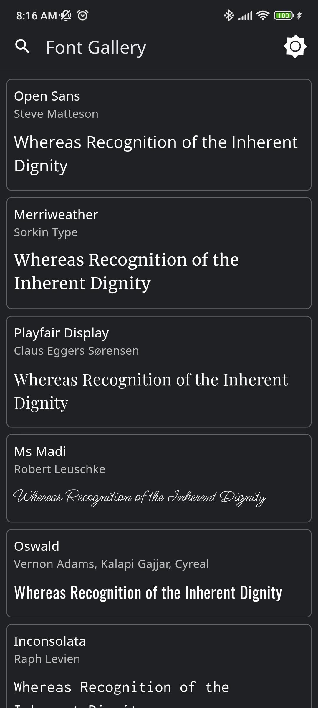
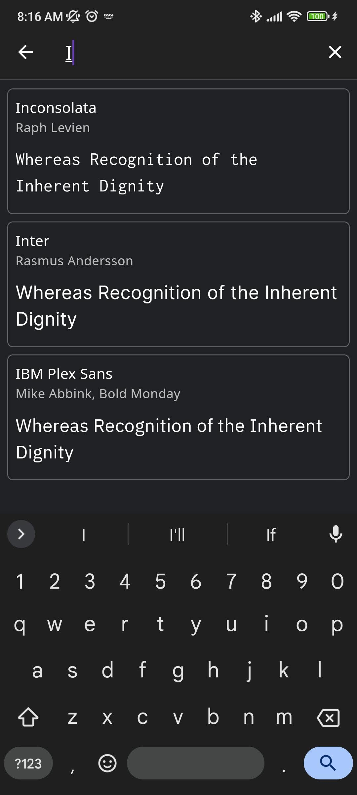
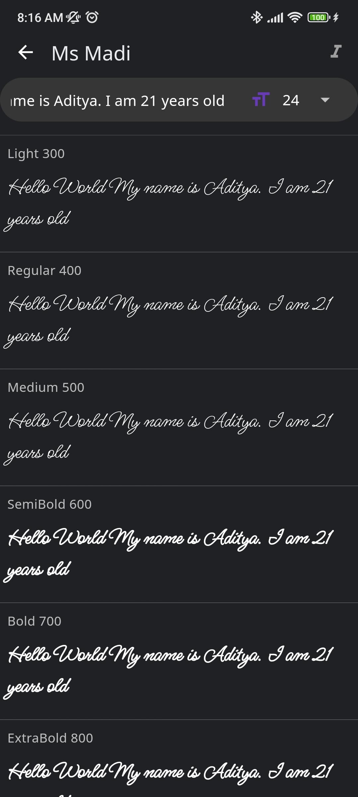
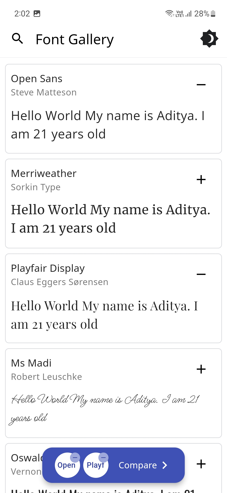
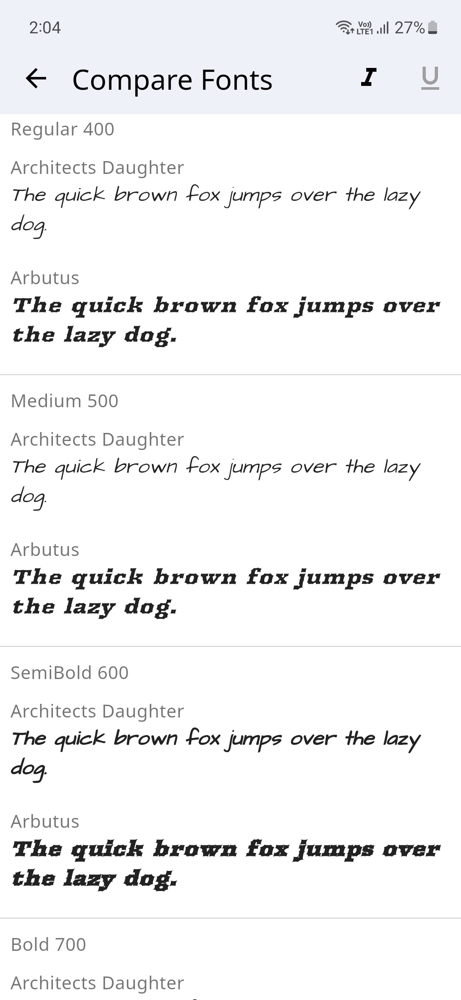

# 📜🖼️ Font Gallery

Font Gallery app showcases how different Font Families with their different variations (Style, Weight and Size) look. You could switch between light and dark modes and also compare different font families.

There's a handy search feature to easily search for your favorite fonts and the text to compare the font's could also be changed to a custom user set text.

The Fonts are sourced from Google Fonts and even the Font Author information is displayed.

Please star⭐ the repo if you like what you see😊.

## 💻 Installation and Usage

<table>
  <tr>
    <th>Platform</th>
    <th>Installation Links</th>
  </tr>
  <tr>
    <td>Android</td>
    <td>
      
       
       
       
      
    </td>
  </tr>

  <tr>
      <td>Windows</td>
      <td>
        
      </td>
  </tr>

  <tr>
      <td>Web App</td>
      <td>
        
      </td>
  </tr>

</table>

## ✨ Features

- [x] Display Different Fonts
- [x] Search for Fonts using their name
- [x] Dark/Light Theme Modes
- [x] Input Text to preview how it would look with the selected Font
- [x] Change Font Size
- [x] Display all the Font Weights
- [x] Option to Display a different Font style
- [x] Display Font Author Information
- [x] Compare Fonts
- [ ] Change Font Colors
- [ ] Generate an Image for the font
- [ ] Multi-Language Support

## 📸 Screenshots
     

## 🔌 Plugins

| Name                                                                  | Usage                               |
|-----------------------------------------------------------------------|-------------------------------------|
| [**shared_preferences**](https://pub.dev/packages/shared_preferences) | To store theme mode preference      |
| [**flutter_lints**](https://pub.dev/packages/flutter_lints)           | For linting                         |
| [**lottie**](https://pub.dev/packages/lottie)                         | For Theme Switch Animation          |
| [**google_fonts**](https://pub.dev/packages/google_fonts)             | For downloading the different fonts |
| [**flutter_riverpod**](https://pub.dev/packages/flutter_riverpod)     | For managing the state              |

## 🤓 Author

**[Aditya R](https://github.com/adeeteya)**

## 🔖 LICENSE
Copyright (c) 2023 **[Aditya R](https://github.com/adeeteya)**
[MIT LICENSE](https://github.com/adeeteya/FontGallery/blob/master/LICENSE)

## 🙏 Attributions
<a href="https://www.flaticon.com/free-icons/font-size" title="font size icons">Font size icons created by Freepik - Flaticon</a>
